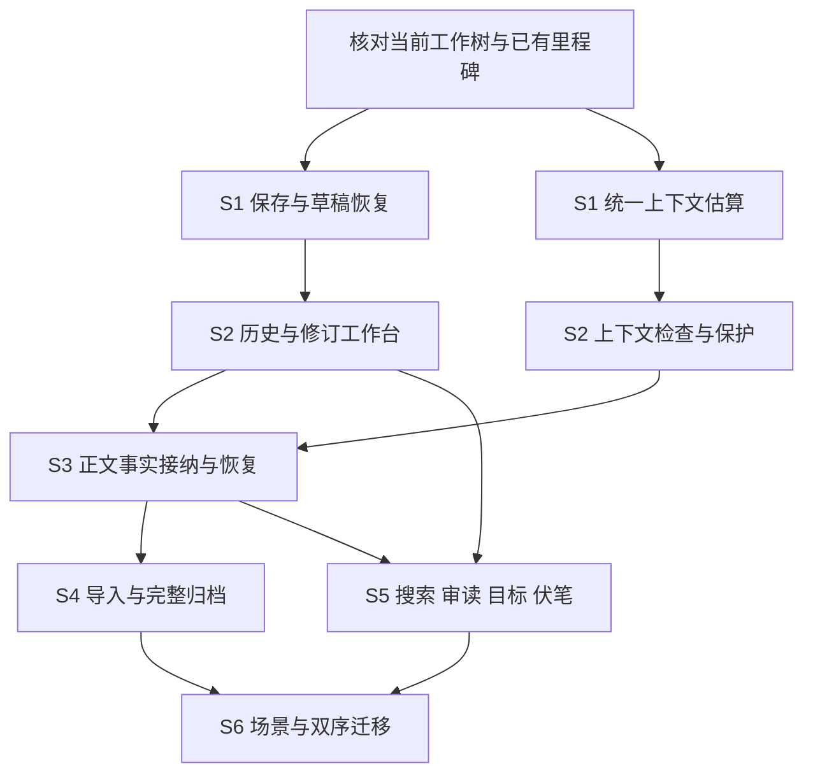

# OpenWrite dsh 插件完善计划

日期：2026-09-05。状态：规划完成，生产实现尚未开始。

## 1. 目标与现有基础

**目标：把 OpenWrite 的 dsh 插件版本完善为稿件可靠、修改可追溯、长篇状态可信的创作工作台。**

OpenWrite 是本团队自己的小说核心；`dsh-novel` 是它的 DeepSeek Harness 插件版本。
以当前两仓库工作树为基础，保留现有章节流水线、Chapter Run V2、六域评审、正典/伏笔、
来源分析、检索、模型配置、框架内横评和 Workspace 隔离。

外部参考依据：[七项目源码对照](TARGETED_NOVEL_PROJECT_REVIEW.md)、[通用工具调研](OPEN_SOURCE_NOVEL_AUDIT.md)。
本计划负责范围、依赖与验收；实施状态和测试证据仍统一记入 [GOAL.md](../GOAL.md)，避免维护第二套完成状态。
本次规划不把既有 M2c/M2d/M2e 或任何新功能标为完成，也不自动创建持续执行目标。

分工保持明确：

| 位置 | 职责 | 本次主要工作 |
|---|---|---|
| OpenWrite 核心 | 领域状态、存储、校验和执行 | 上下文计量/保护、正文事实联动、导入恢复、项目归档、场景模型 |
| dsh-novel bridge / 预设 | 把核心能力接到 dsh | 类型与错误契约、revision、Workspace 路由、失效事件、创作流程接线 |
| dsh-novel 工作台 | 作者的编辑与决策入口 | 保存、恢复、历史/diff、上下文检查、审阅修订、导入导出和长篇组织 |

## 2. 分阶段交付

| 阶段 | 作者能得到什么 | 主要落点 | 依赖与规模 |
|---|---|---|---|
| S1 可靠性修复 | 连续输入可靠保存，失败能恢复，预算数字一致 | panel + OpenWrite 估算器 | 先做；保存与估算两条线可并行 |
| S2 可控创作工作台 | 查看历史、比较/应用 AI 修改、检查上下文来源 | panel 为主，core/bridge 补契约 | 依赖 S1；中等改动 |
| S3 改稿后的事实联动 | 修改早期章节后，知道哪些事实、摘要和后文需要更新 | OpenWrite 为主，贯通三层 | 依赖 S1/S2 的版本与状态展示；较大领域改动 |
| S4 导入、归档与成稿交付 | 旧稿导入可恢复，整部作品可迁移，导出前能检查 | OpenWrite + Operations/资料视图 | 完整落地依赖 S3 的事实状态；可先设计归档格式 |
| S5 日常长篇操作 | 伏笔到期清单、目标进度、搜索回跳、跨卷排序、连续审读 | panel + 少量核心动作 | 以稳定版本/定位契约为基础，可拆小交付 |
| S6 场景与双序组织 | 独立场景、阅读顺序和故事时间、人物/情节线视图 | OpenWrite 模型与迁移 + panel | 后置；依赖 S3/S4/S5，属于较大结构变更 |

**建议首个交付批次覆盖 S1 + S2，验收主题是“稳定编辑与可控修订”。**
随后交付 S3，使修改和长篇状态真正联动；再完成 S4/S5。S6 单独推进，避免场景迁移拖住基础可用性。
这不是工期承诺；每阶段以可见产物和验收结果推进。

### S1：先消除已确认的可靠性问题

#### S1.1 正文保存状态机

落点：[CreationView.tsx](../packages/studio-panel/src/client/CreationView.tsx)、
[WorkbenchStore.ts](../packages/studio-panel/src/client/WorkbenchStore.ts)、
[api.ts](../packages/studio-panel/src/client/api.ts)。

- 每次提交冻结正文、文档身份和源版本；只把该请求实际确认的文本记为已保存。
- 同一文档的写请求串行执行；请求期间的新输入保留待保存状态，并使用更新后的服务器版本继续提交。
- 文档身份包含 Workspace、作品与章节；上下文切换、epoch 刷新、请求迟到和组件卸载均检查身份/代次。
  排队请求不能在发送时重新读取已切换的全局 Workspace 请求头；切换后停止旧队列、保留旧稿。
  已发送的 PUT 可能已经落盘，取消等待不等于撤销服务端写入，恢复时需重新核对版本。
- 失败、冲突、等待保存、保存中、已保存分别展示；网络异常不能清除未提交草稿。
- 核验 OpenWrite `write_document` 的响应确实对应本次提交：当前保存后在写锁外重读文档，
  不能直接假设返回版本与本次请求正文绑定。必要时在同一临界区生成确认快照，并保留明确的冲突语义。

验收：延迟 A 请求时输入 B，A 返回后 B 仍待保存并最终落盘；连续手动保存与自动保存不乱序；
409/离线重试保留正文；切换章节或 Workspace 后旧响应不覆盖新编辑器；自身保存触发的刷新不回滚新输入。
把前轮 [缺陷复现](research/autosave-race-repro.mjs) 转成正向组件回归，不能保留“复现 bug 即通过”的断言作产品门禁。

#### S1.2 本地草稿恢复

- 建立专用正文草稿存储，优先使用 IndexedDB，通过小型存储接口隔离实现；现有 localStorage 继续承载面板偏好。
- 草稿携带 Workspace/作品/章节、基础 revision、更新时间和格式版本；身份未绑定时不写入共享 `default` 草稿槽。
- 服务器确认同一份正文后才清理对应草稿；新稿不能被旧请求清理。恢复时比较基础版本，提供查看/恢复入口。
- 存储失败明确显示恢复保护不可用，仍保留当前编辑器内容；恢复不会静默覆盖服务端更新。

验收：刷新后能找回未提交稿；同名章节在不同 Workspace 下不串稿；旧基础版本产生恢复冲突；
保存期间再次输入后刷新，能恢复最新草稿；存储不可用不出现虚假的“已备份”。

#### S1.3 统一上下文计量

落点：[context_package.py](../../OpenWrite/models/context_package.py)、
[context_manifest.py](../../OpenWrite/tools/context_manifest.py)、[context_builder.py](../../OpenWrite/tools/context_builder.py)。

- 清单和执行预算复用同一公共估算器，明确计量的是哪段渲染文本、是否包含包装开销。
- 保留“估算值”和供应商实际用量的区别；中文、英文和混合文本有一致口径。
- 本轮已确认的 1,500 汉字 → 清单 1,000 / 预算 2,250 的差异应消失。

验收：同一段渲染文本的估算一致；分项与总计之间的差额能解释；不会把未知实际用量显示为 0。

### S2：把已有能力接成作者能用的闭环

作者路径：**选择章节 → 编辑/恢复 → 查看评审 → 选择修改建议 → 比较候选 → 应用 → 复评**。

#### S2.1 历史、修订与轮次变更

复用 [manuscript_editing.py](../../OpenWrite/tools/manuscript_editing.py)、
[revision_service.py](../../OpenWrite/tools/revision_service.py)、
[TurnMutationSummary.tsx](../packages/studio-panel/src/client/TurnMutationSummary.tsx)。

- 正文历史：版本列表、命名快照、前后差异、恢复预览与恢复前备份。
  当前普通保存走 Git checkpoint，章节版本列表来自 ManuscriptVersionStore；先统一作者可见历史的覆盖规则。
  建议记录手动保存、写作会话检查点、AI 应用前、恢复前等节点，合并高频自动保存，避免无限快照。
- 修订建议：原因、对应评审证据、原文/候选、目标范围、采用/拒绝/重新生成；替换现有 JSON 主展示。
- 轮次摘要：从工具/路径清单升级为实际成功写入的变更及历史入口；无写入、部分失败、写入后刷新失败分别说明。
- 沿用后端 revision/confirm；失效提案先刷新或重新生成，不靠偏移坐标直接覆盖当前文本。
  恢复使用现有 `confirm:true`；修订采用使用显式 apply 动作，不臆造统一确认字段。
  核验普通保存、修订、恢复的共同写锁与顺序，保证“检查版本→写入”不可被另一入口穿插。
- 局部差异采用需补足服务端契约：当前 `selected_hunk_ids` 只校验/记录，实际写入取 `replacement_text`。
  服务端应从固定源版本组合选中差异，或验证提交文本与选择完全一致；不能只发送勾选 ID 就声称只应用了这些块。
- 证据定位先用现有 quote/revision/anchor；定位不唯一时明确失效，不把错误原文高亮成证据。稳定块/行 ID 可后续增强。
  原始 Markdown、编辑器渲染位置、Python 字符位置与 JS UTF-16 偏移需明确转换，覆盖中文、emoji、重复引用和删除。

验收：旧版本可比较和恢复，恢复前内容仍可找回；修改了源正文的旧提案不能覆盖新稿；
重复点击应用不产生重复写入；正文成功变化后评审/交付新鲜度和界面同步失效。
完整“回滚到某次对话前”的跨对象事务放在 S3 的依赖/恢复契约稳定后接入，S2 先做好文档历史与实际变更。

#### S2.2 上下文检查与约束保护

- 展示真正用于写章的上下文清单：来源、片段、选择理由、版本、预算、压缩/排除原因与缺项。
- 明确不可静默裁剪的作者硬约束、关键正典与本章必需条件；保护内容超预算时返回原因和调整入口。
  保护范围从加载、压缩一直贯通最终渲染；当前加载/渲染也有截取路径，不能只修改 `_force_fit`。
- 区分 dsh 会话预算与 OpenWrite 写章请求预算，两者各自说明；缺失的 system/tools 等统计标为不可用，不能混加两次调用凑总数。
- 把检索刷新、过期与不可用原因接到现有索引服务；用户能回到源文件核对，不新增平行检索系统。

验收：面板能核对本次实际 packet revision；修改来源后旧清单标记过期；保护项超限不被自动截掉后继续生成；
普通超预算只压缩允许压缩的内容，并记录结果；切换章节/Workspace 后来源与预算一起切换。

#### S2.3 同期完成已有 Operations 剩余任务

将既有 **M2c** 保留为结果页任务，补齐输入/上下文 hash、真实阶段、错误原因、模型身份、
实际 token/费用、候选结果和独立评审对照；复用 S2 的来源/差异展示。
本地已有框架内横评与独立 reviewer，工作重点是结果可理解与历史产物兼容。
比较结果按上下文 hash/版本分组，计量或压缩算法变化后不能把旧、新输入混成同条件测试。
M2c 的完成仍须按 [GOAL.md](../GOAL.md) 留证据，本计划不能替代验收。

**M2d 研究工作台** 同期使用已有 research DTO、task_id、result_ref、来源、失败状态和 Workspace 设置，
补筛选、详情、来源核查、导出与移动布局。它可与 S3 设计并行，不等待 S4 的导入/归档功能。
研究报告和参考作品拆解是不同产物，可共享展示组件，但研究报告不能自动成为正典。
UI 验证优先使用现有工件与受控夹具，不把新一轮在线模型横评作为页面开发前置条件。

### S3：让改稿与长篇事实保持一致

重点落点：[chapter_run_v2.py](../../OpenWrite/tools/chapter_run_v2.py)、
[chapter_pipeline.py](../../OpenWrite/tools/chapter_pipeline.py)、
[runtime_state.py](../../OpenWrite/tools/runtime_state.py)、[revision_service.py](../../OpenWrite/tools/revision_service.py)。

先核查所有正文写入入口，再补缺失契约。已有阶段、快照和 revision 继续复用。

1. **识别变化**：保存已接纳正文 SHA；覆盖面板保存、Agent 写入、修订应用、历史恢复与外部编辑器改稿。
   旧稿没有接纳记录时标为“基线待建立”，不能把当前磁盘内容静默登记成已验证事实。
2. **列出影响**：追踪事实、人物状态、伏笔、章节/卷摘要、评审和后续计划所依赖的源 revision。
3. **生成并接纳差异**：事实提取记录源 SHA；采用前再次核对，依既有规则应用；普通手工保存保持及时，不被事实提取阻塞。
4. **重建与失效**：更新受影响派生物；没有精确依赖记录的历史数据采用保守失效并解释原因。
   保留作者的大纲和计划正文，标注待复核；失效不等于删除或自动改写，正典、模型候选和可重建缓存分别处理。
5. **恢复执行**：持久化冻结的提交载荷与阶段进度；失败从有效阶段恢复，重复执行不重复推进事实。

作者看到的是“正文已保存，关联事实待更新 / 更新中 / 需要处理”，无需理解内部任务文件。
续写前校验所需事实版本；可保存、审阅和备份处于待更新状态的稿件，不能把等待事实更新等同于保存失败。

验收：修改早期人物存亡或事件后，旧摘要/后文计划不会继续被当作当前事实；提取期间再次改稿会拒绝旧结果；
取消、超时、进程中断后的恢复沿用固定输入；部分提交能恢复到一致状态；不会用恢复旧章重置不相关的当前事实。
需故障注入验证关键持久化窗口，单次 `rename` 或 try/except 回滚不能替代整个业务恢复证明。
接纳事实与传播失效作为一个可恢复业务操作：事实已更新、后续失效尚未完成时，记录待恢复状态，
不能继续把尚未处理的派生物当作当前事实使用。

跨对象的轮次回滚在此阶段评估：根据实际成功写入记录预览恢复范围，拒绝覆盖后续独立修改，
正文与派生物按同一依赖规则恢复/失效；不把删除聊天消息当作撤销业务变化。

### S4：旧稿导入、完整归档与成稿预检

复用 [novel_workspace.py](../../OpenWrite/tools/novel_workspace.py)、
[source_analysis.py](../../OpenWrite/tools/source_analysis.py)、
[reference_library.py](../../OpenWrite/tools/reference_library.py)、
[asset_package.py](../../OpenWrite/tools/asset_package.py)。

- **导入工作区**：源快照 → 切分预览 → 确认结构 → 逐章分析/事实回填 → 全书综合 → 发布；
  每阶段带输入指纹、进度和失败点。标题规则不足时再提供语义切分，作者可编辑边界；分析参考作品与导入自己旧稿使用不同入口和采用规则。
- **完整作品档案**：版本化 manifest、正文、大纲、角色/设定、历史、评审、来源引用、校验和；
  明确包含/排除与缺失项，凭据留在项目外；跨路径恢复处理 ID/引用与旧任务归档，不自动续跑旧路径任务。
- **导出预检**：显示实际章节顺序、缺失/重复/空章、字数和元数据、评审新鲜度；EPUB 增加格式检查。
  草稿/备份与正式交付分别处理，未通过评审仍可备份。
- **复用研究工作台**：复用 S2 同期 M2d 的来源/任务/报告展示组件，与正式稿件导入、参考作品分析/采用保持清晰入口。

验收：导入中断可从有效阶段继续，源文件变化只重跑受影响阶段；半发布不能冒充完成；
归档在新路径恢复后正文/结构/历史一致，缺项有明确结果；重复章 ID 不被静默丢弃；EPUB 通过格式检查且人工抽查目录/正文。

### S5：完善日常写作效率

- 当前章节的伏笔到期/超期/待埋入列表，能查看来源和当前上下文去向。
- 呈现已有章/卷/书目标与正文专属统计，统一中文口径；之后再加可暂停、可恢复的写作冲刺记录。
- 搜索命中回到正确版本的原文，支持范围与替换预览；有冲突时不盲目批量替换。
- 大纲跨卷移动与多选排序由后端维护次序/归属，引用不随显示顺序失效。
- 整章/整书连续审读，批注和评审证据可跳回编辑；同一套版本定位服务供搜索和审读使用。

验收：修稿、重排、搜索回跳、全文导出引用同一阅读顺序；同名文档不会误定位；
统计不把设定资料或重复模型结果算入正文；无法证明输入来源时不虚构“人工/AI 字数”分类。

### S6：场景作为独立领域对象

在 [models/outline.py](../../OpenWrite/models/outline.py) 及相关契约中设计稳定 scene ID，
所属章节、正文定位、阅读顺序、故事时间、POV、在场/提及人物、地点、状态与摘要。
优先定义与章节文件和修订锚点的关系，再做卡片/时间线界面。

- `reading_order` 与 `story_time` 独立；插叙不改变故事时间以迎合阅读序号。
- 重排、跨章移动、拆分/合并保留正文、引用和历史映射；影响事实时走 S3 的接纳与失效规则。
- 旧章项目可按章继续写；迁移前预览，保留可恢复数据与格式版本。归档同步升级。

验收：含倒叙/插叙的样例能分别按阅读与时间展示；场景搬移不丢正文或串引用；
旧格式恢复、升级和导出都有明确行为。先完成这些，再考虑更复杂的情节泳道或可视化。

## 3. 依赖与可并行工作

执行时可以将 panel 保存与 OpenWrite 计量修复并行；共享 API/schema 先固定，再并行接前后端。
M2c/M2d 与 S2 同期推进，不等待 S3–S6。基础归档可在稳定 ID 与 manifest 约定后独立开发，
完整导入事实恢复依赖 S3；归档不必等场景实体完成，之后通过 schema 升级支持场景。
避免多个执行者同时改同一存储/状态机或生成契约文件。

## 4. 如何与旧路线、测试和维护衔接

- 本计划提出新的优先顺序；开工时先核对工作树是否已有修复，再在 `GOAL.md` 标明当前执行阶段及关联的 M2 项。
  已完成的 M2a/M2b 保留；M2c/M2d 的旧证据与待办不因本计划消失。
  表中 M3–M6 与后来的 M2 系列有重叠，实施时根据现有代码和证据合并引用，不从名称推断完成或再建一遍。
  旧编号应标注被哪项替代并保留日志；历史“Operations M2c: independent Embedding surface”是模型迁移记录，
  不代表 M2c 横评结果页已完成。本次仅提出整理方式，未改变旧状态。
- **M2e 是原 Operations 的终验，仍需独立完成。** 新的 S 阶段各自有定向验证；S1+S2 交付前另外做稳定编辑批次的端到端验收。
  扩展全产品时再次验证新增路径，不能把旧桌面截图、跳过的 E2E 或早期全套测试当作新功能证明。
- 对每个变更只增加解决具体风险的用例：纯函数测估算/依赖；React 测保存竞争/修订交互；
  后端测事务/版本/恢复；跨层测 schema/Workspace/epoch；真实浏览器检验最终作者流程。
- 相关改动完成后运行仓库已有 `npm run check` 和受影响的 OpenWrite pytest；
  需要真实服务的 `scripts/verify.sh` / `npm run test:e2e` 在交付批次执行，跳过不算通过。
- 手工、真实服务及浏览器 QA 仅用 `~/my_novel`。自动化 pytest 可用隔离临时目录，必须注入隔离 ProjectRegistry，
  不写用户默认最近项目列表。已有 A/B 隔离用例需要按当前约束选择自动化运行方式。
- 保留两仓库现有未提交改动；实现按小批次、可审阅差异推进。结构迁移必须包含格式版本和恢复策略。
- 保持现有六域评审及质量/覆盖率/阻断/交付的区分。真人样章校准是独立验收项，当前 uncalibrated 时不启用生产门禁。
  模型质量、网络错误与成本分别记录；此次规划不增加模型服务或更换 Agent 运行时。

## 5. 开工后的前三个独立改动

| 顺序 | 改动包 | 交付证据 |
|---|---|---|
| 1A | panel 保存请求快照、串行队列、文档身份和刷新隔离；核验核心保存响应绑定 | 延迟请求期间输入、切章/Workspace、冲突/失败重试的组件回归；真实浏览器连续输入落盘 |
| 1B（可并行） | OpenWrite 公共估算器与 context manifest 对齐 | 中文/英文/混排同输入计量一致；现有上下文测试与契约通过 |
| 2 | 草稿恢复 + 章节版本/差异/恢复入口 | 刷新恢复、基础版本冲突、历史恢复前快照；作者可从界面完成整条操作 |

之后进入 S2 上下文保护与修订工作台，按本计划展开后续领域改进。本轮交付的是规划文档，尚未实施上述改动。
