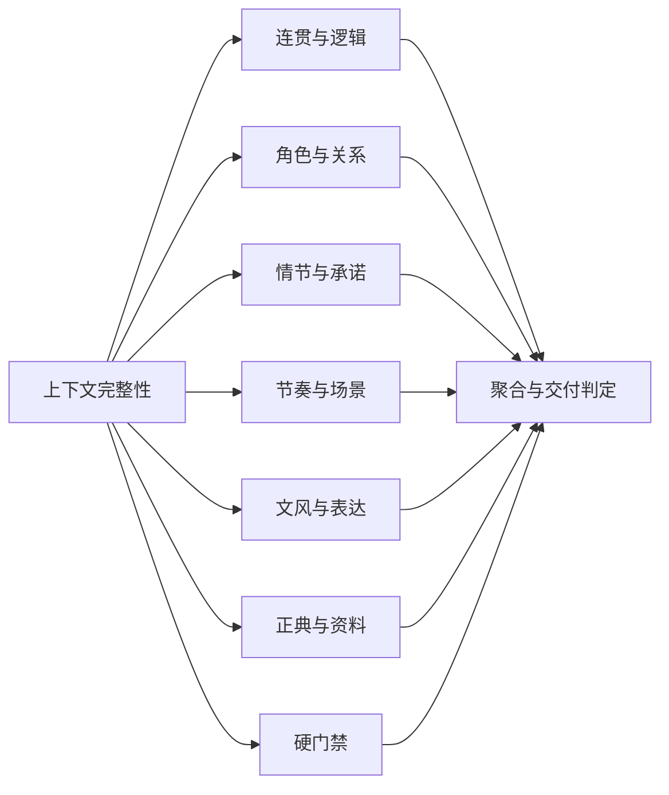

# 标准章节审稿 DAG

审稿 DAG 由 OpenWrite 定义一次，dsh-novel 对每章只做实例化。章节审稿不再在 Python conductor 和 TypeScript bridge 中各自拼装节点与依赖。

## 权威来源

- 蓝图：OpenWrite `tools/review_dag_framework.py`
- 评分准则：OpenWrite `tools/review_rubric.py`
- 查询接口：`GET /api/review/framework`
- dsh 工具：`novel_review_framework`
- 章节实例：`data/novels/<novel_id>/data/dog/reviews/<chapter_id>/dog-graph.json`

蓝图使用 `openwrite.review-dag-framework.v1` 契约、语义版本和 SHA-256 修订号。每份 `review.json` 都记录 `frameworkId`、`frameworkVersion` 与 `frameworkRevision`，因此历史审稿可以准确追溯到当时的框架。

## 固定拓扑



完整蓝图有 47 个节点、46 条包含边和 14 条执行依赖：

- 1 个根节点，负责整章完成条件。
- 1 个上下文前置节点，校验正文版本与评审基线。
- 6 个质量域，共 20 条加法评分准则。
- 36 个质量检查叶节点，兼容既有检查编号。
- 1 个硬门禁和检查 27；门禁结果不混入质量分。
- 1 个聚合节点，只消费 OpenWrite 的 `review_v2` 权威判定。

局部审稿仍保留 47 个节点。未请求的检查写成 `inconclusive`，因此不同章节之间可以比较拓扑、覆盖率和历史记录，不会因参数不同生成一张结构不同的图。

## 实例化流程

1. OpenWrite 按评分准则生成 `review_v2`。
2. materializer 获取当前蓝图，只绑定 `chapter_id` 和章节产物目录。
3. materializer 写入 context、domain、dimension、gate、aggregate 记录。
4. DoG verifier 读取这些确定性记录，不再次调用模型，也不重算评分。
5. Studio 图谱页显示框架版本、六域、37 项检查和 20 条准则；尚未审稿时也能看到框架身份。

Python 与 TypeScript 使用同一份 OpenWrite 蓝图实例化，并有跨语言图结构一致性测试。

## 扩展规则

现有 v1 拓扑保持锁定。日常扩展使用四个明确入口：

| 扩展点 | 可以做什么 | 产物约束 |
|---|---|---|
| `context-evidence` | 加入时间线、角色状态、资料来源等前置证据 | 增补 `context.json`，保留来源与版本 |
| `domain-evaluator` | 更换或增加某个质量域的证据提取器 | 按 `rubric.criteria` 返回评分与证据 |
| `gate-evaluator` | 接入敏感词或其他确定性门禁实现 | 显式返回 pass / blocked / inconclusive |
| `post-review-policy` | 根据权威判定触发修订、复审或交付 | 消费 `review_v2`，不重新推导结论 |

需要增加节点、删除检查、改变归属或修改依赖时，升级框架版本并重新计算修订号；不能在单章实例里临时改图。需要调整提示词、模型或证据提供器时，使用扩展点，不必改变 DAG。

## 维护检查

```bash
cd /Users/jiaoziang/OpenWrite
.venv/bin/pytest -q tests/test_review_dag_framework.py tests/test_review_v2_http.py

cd /Users/jiaoziang/dsh-novel
npm --prefix packages/openwrite-bridge run build
.venv/bin/python conductor/test_dog_artifacts.py
npm --prefix packages/openwrite-bridge run smoke
npm --prefix packages/studio-panel run test:components
```

校验会阻止缺失或重复检查、多父节点、悬空边、依赖环、不安全的产物路径，以及 Python/TypeScript 实例不一致。
