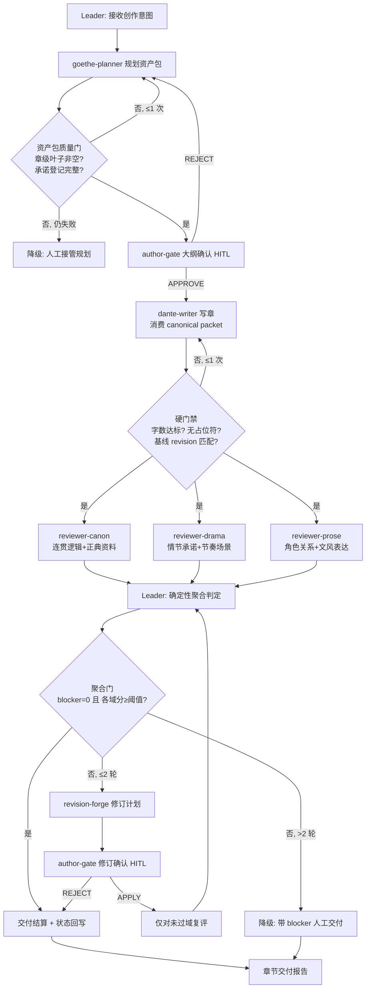

# Workflow: OpenWrite 长篇创作蜂群（规划 → 写作 → 六域评审 → 修订闭环 → 交付）

## Overview



评审三角色互相隔离（看不到彼此结论，也看不到主笔过程稿）——隔离是评审价值的一部分，见 [bind.md](bind.md) § Behavioral Constraints。

## Detailed Steps

### Step 0 — Pre-flight: 依赖检查

- **Executor**: Leader
- **Input**: [dependencies.yaml](dependencies.yaml)
- **Action**: 逐项核对技能（OpenWrite 12 改写技能集）与工具（python / openwrite-mcp，已在 jiuwenswarm config.mcp.servers 注册）可用性
- **Output**: pre-flight 报告（缺失项 + required 级别）
- **Quality gate**: 用户决定 go/no-go；Agent 不自动决定

### Step 1 — 规划资产包

- **Executor**: goethe-planner
- **Input**: 创作意图、题材约束、既有资产（如有）
- **Action**: 收敛意图 → 人物卡 → 世界观 → 卷/幕/节/章四级大纲（章级节点含承诺清单与伏笔登记）
- **Output**: 结构化资产包（见 roles/goethe-planner.md Output Schema）
- **Serial / Parallel**: 串行
- **Quality gate**: 章级叶子数 ≥1；每章 ≥1 条承诺；人物卡 ≥1。未过门重派 1 次；仍失败 → 降级 D1（人工接管规划）

### Step 2 — 作者确认门：大纲定稿

- **Executor**: author-gate（人类）
- **Input**: 资产包 + 承诺登记完整性摘要
- **Action**: APPROVE 进入 Step 3；REJECT（附缺口）回到 Step 1
- **Output**: Gate 决定
- **Quality gate**: 决定必须是枚举值；悬置超时按 bind.md 视为驳回
- **HITL 说明**: SwarmFlow 执行模式下此门以人工节点（human/human_session）实现；脚本模式降级为返回待批 payload（见 bind.md）

### Step 3 — 章节写作

- **Executor**: dante-writer
- **Input**: 已确认资产包 + canonical context packet（正文基线、章节记忆、风格指纹、伏笔待办、truth 状态）
- **Action**: 复述承诺 → 撰写正文 → 状态回写清单（truth/伏笔/人物）
- **Output**: 章节正文 + 回写清单 + 冲突登记
- **Serial / Parallel**: 串行
- **Quality gate**: 硬门禁——正文字数达纲、无占位符/TODO、无 `CONFLICT` 未决项。未过门重派 1 次；有设定级冲突 → 登记 planner-return，暂停本章

### Step 4 — 六域并行评审

- **Executor**: reviewer-canon / reviewer-drama / reviewer-prose（并行）
- **Input**: 同一正文基线 + 各自域的资产（truth/大纲/人物卡等）
- **Action**: 每个评审员覆盖 2 个质量域，输出 per-domain 评分 + findings + 证据
- **Output**: 三份结构化评审
- **Serial / Parallel**: 3 路并行（max_parallel_teammates=3）
- **Quality gate**: 域覆盖率 = 6/6；某评审超时/格式错 → 重派 1 次，再失败标 `[inconclusive]`，聚合时该域按缺失处理（见 bind.md）

### Step 5 — 聚合判定（Leader，确定性规则）

- **Executor**: Leader（不做 LLM 聚合，只执行规则）
- **Input**: 三份评审 + 门禁记录
- **Action**: 规则依次求值：
  1. `blocker_total = Σ 各域 severity=blocker 的 finding 数`
  2. `domain_scores = 六域 score`（缺失域记 inconclusive）
  3. 通过条件：`blocker_total = 0` 且 `min(已评域分) ≥ 6` 且 `inconclusive 域数 = 0`
- **Output**: 聚合判定（PASS / REWORK + 未过域清单 + blocker 清单）
- **Serial / Parallel**: 串行
- **Quality gate**: 判定必须是可枚举结论；任何域 inconclusive 不得判 PASS

### Step 6 — 修订与复评（REWORK 时，最多 2 轮）

- **Executor**: revision-forge → author-gate → 未过域 reviewer 复评
- **Input**: 聚合判定 + 对应域 findings + 正文基线
- **Action**: 修订计划（逐条挂证据）→ 作者预览 diff 批准 → 应用 → 仅对未过域对应的评审员依次重派复评（主笔不重写整章）
- **Output**: 应用摘要 + 新基线 revision + 复评结果
- **Serial / Parallel**: 复评并行度 ≤3
- **Quality gate**: 2 轮后仍不过 → 降级 D2：带 blocker 清单人工交付，报告头部标 `DELIVERED-WITH-BLOCKERS`

### Step 7 — Final: 交付结算报告

- **Executor**: Leader
- **Input**: 全部上游产物
- **Action**: 汇总正文版本链、六域评分与证据、门禁与修订历史、状态回写清单、遗留事项
- **Output**: 章节交付报告（格式如下）

#### Final Report Format

```markdown
# 章节交付报告

## Summary
<一章一句：本章完成了什么、质量判定、修订轮数>

## 正文版本链
- <revision>: <写作/修订轮次来源>

## 六域评分（OpenWrite review-dag-framework.v1）
- 连贯与逻辑: <score> — <关键 finding 或 "无">
- 角色与关系: <score> — <...>
- 情节与承诺: <score> — <...>
- 节奏与场景: <score> — <...>
- 文风与表达: <score> — <...>
- 正典与资料: <score> — <...>
- 硬门禁: <PASS/BLOCKED 记录>

## 判定
- <DELIVERED | DELIVERED-WITH-BLOCKERS | FAILED>

## 修订历史
- <轮次>: <修订条数> 条，对应 findings <数量>；作者门决定 <APPLY/REJECT>

## 状态回写清单
- truth: <...>；伏笔: <...>；人物: <...>

## 遗留事项
- <planner-return / style-objection / outline-objection / hard-block，逐条>
```

### Step 8 — 写回引擎（可选，运行时经 openwrite-mcp）

- **Executor**: Leader（JiuwenSwarm 运行时内经 MCP 工具执行；SwarmFlow 脚本不内嵌该链路，由运行时 Leader 代理）
- **Input**: 已确认资产包 + 交付章节正文
- **Action**: `create_project` → `save_foundation_draft`/`promote_foundation` → `save_outline_draft`/`promote_outline` → 人物卡写 `src/characters/` → `save_external_chapter` → `accept_manuscript`（指纹门两阶段）→ `resume_acceptance` → `acknowledge_impacts` → 后续章 `write_chapter`/`review_chapter` → `export_book`
- **Output**: 引擎书稿项目 + 双章/多章 EPUB
- **Quality gate**: 每个两阶段门 confirm=false 预览 → confirm=true 生效；revision 冲突即拒绝；写路径工具缺失时跳过（降级，交付物为纯文本报告）

## Acceptance Criteria

- 三份评审输出均匹配各自 Output Schema（无格式错漏）。
- 六域覆盖率 6/6 或有显式 `inconclusive` 记录且判定不为 PASS。
- 所有门禁（规划门、硬门禁、聚合门、作者门）都有显式通过/失败记录，无静默跳过。
- 修订轮数 ≤2；超限触发的 D2 降级在报告中显式标注。
- Final Report 含全部必备小节（正文版本链、六域评分、判定、修订历史、状态回写、遗留事项）。
